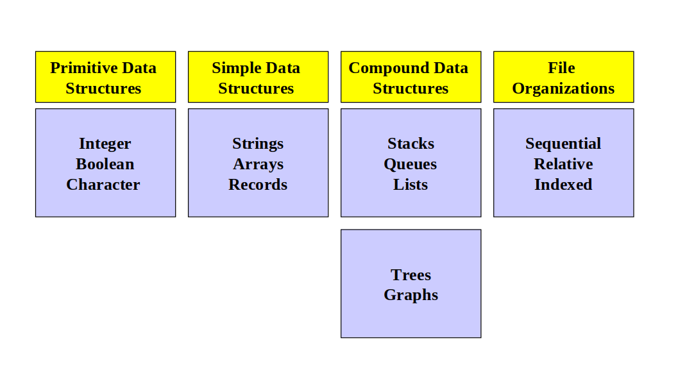

## 자료구조란?

자료구조를 공부하는 것은 알고리즘을 해결하는데 뿐만 아니라, 라이브러리나 프레임워크를 사용할 때 단순히 가져다 쓰지 않고, 내부적으로 어떻게 구현되있는지에 대한 이해도가 향상되므로 라이브러리에 있는 적절한 자료형을 사용할 수 있다.

### OOP와 자료구조

자료구조란 위키백과의 정의에 따르면 `자료를 효율적으로 이용할 수 있도록 컴퓨터에 저장하는 방법`이다.
즉, 어떠한 알고리즘을 구현하는데 있어 그에 맞는 자료구조를 설계하여 사용해야 시간적으로 혹은 공간적으로 자원을 최소화 할 수 있다.
사실, 위의 말은 이제 프로그래밍을 시작하고 자료구조라는 단어를 처음 듣는 사람들에게는 잘 와닿지 않는다.
조금 더 구체적으로 말하자면, 모든 프로그래밍 언어들에는 `int, char, boolean` 등의 가장 기본적인(primitive) 자료형이 존재한다.
그러나 primitive 자료형으로만 코딩을 했을 때, 재사용성이 떨어지고 제한적이다.
그렇기 때문에 주로 사용자 자료형, 다시 말해 추상 자료형(Abstract Data Type, ADT)를 정의하여 사용하는 것이 바람직하며, ADT가 곧 자료구조라고 할 수 있다.

<!--more-->

물론, 배열이나 리스트 등 대표적인 자료구조는 (특히, 상위 레벨 언어에서는) 이미 예약어로 존재하지만, int와 같이 직접적으로 메모리에 할당되는 것이 아니라 언어의 버전이 올라갈수록 사용자의 편의를 위해서 구현한 것이므로 primitive로 분류하지 않는다.
ADT는 Object Oriented Design에서 Class와 사실상 거의 동일하므로, 클래스를 이용하여 구현하는 것이 효율적이다.
클래스처럼, ADT는 attribute와 operation을 가지고 있으며, OOD의 Encapsulation을 따라서, attribute는 private로 제한하고 모든 수행은 operation을 통해서 한다.
UML의 창시자인 Grady Booch에 따르면 OOP의 다음 3가지를 충족해야 한다.

 1. 객체는 기본적인 블록 단위로 구성되어 있다.
 2. 각 객체는 클래스의 인스턴스이다.
 3. 클래스는 상속을 지원한다.

C++이나 Java 등 대표적인 객체지향언어는 위 정의에 따라서 프로그래밍이 가능하다.
따라서, 객체지향언어는 primitive 자료형도 클래스로 구현되어 있다.
그렇기 때문에 아래의 두 문장은 동일하다.

```c++
int a = 10;
int a(10);
```

### 대표적인 자료구조형



위 그림에 있는 자료형이 자료구조의 가장 대표적인 자료형이다.
자료구조의 operation은 내부적으로 primitive 자료형에 의해서 수행되며, 결국 operation도 일련의 알고리즘이므로, 자료구조와 알고리즘은 밀접한 관계를 가진다.
C++에서는 C++11부터 Standard Template Library(STL)에는 동적 배열인 Vector부터 List, Stack, Queue 등의 대표적인 자료구조가 구현되어 있다.
이 라이브러리의 내부 연산을 직접 보는 것도 자료구조를 공부하는데 효과적인 방법이다.
